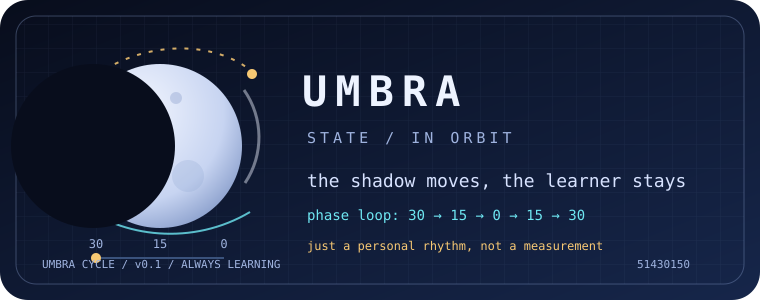

<pre style="font-family:'Courier New',Courier,monospace;font-size:12px;line-height:1.17;white-space:pre;background-color:#000;color:#fff;padding:8px;margin:0;">█  █ █  █ ▄▀▀▄ █  █ ▄▀▀▀ █  █ █  █ ▄▀▀█ ▄█ █▀▀█ ▄█ █▀▀█ ▄▀▀▄
▓▄▄▓ ▓  ▓ ▓▄▄▓ ▓▄ ▓ ▓ ▀▓ ▀▄▄▓ ▓  ▓ ▓▄▄   ▓    ▓  ▓    ▓ ▓▄ ▓
▒  ▒ ▒  ▒ ▒  ▒ ▒ ▀▒ ▒  ▒    ▒ ▒  ▒ ▒     ▒ ▒▀▀▀  ▒ ▒▀▀▀ ▒ ▀▒
░  ░ ░  ░ ░  ░ ░  ░ ░  ░ ▄  ░ ░  ░ ░  ▄  ░ ░  ░  ░ ░  ░ ░  ░
▀  ▀  ▀▀  ▀  ▀ ▀  ▀  ▀▀▀  ▀▀   ▀▀   ▀▀▀  ▀ ▀▀▀▀  ▀ ▀▀▀▀  ▀▀ </pre>

### _Half-baked programmer_ · _半吊子程序员_

<table width="100%">
  <tr>
    <td width="33%" valign="top"></td>
    <td width="33%" valign="top"></td>
    <td width="33%" valign="top"></td>
  </tr>
  <tr>
    <td width="33%" valign="top"></td>
    <td width="33%" valign="top"></td>
    <td width="33%" valign="top"></td>
  </tr>

</table>

## CURRENT QUEST

- [ ] 把模糊想法做成可运行程序
- [ ] 把新知识写成可复用笔记
- [ ] 完成、记录、发布，然后进入下一轮

---

## SIGNAL CARDS

<table width="100%">
  <tr>
    <!-- WEEKLY_SIGNAL_START -->
    <td width="50%" valign="top">
      <pre>╭─ WEEKLY SIGNAL · W37 ────────────────────╮
│2026-09-02 -&gt; 2026-09-08 · UTC+8          │
├───────────────┬──────────────────────────┤
│     /\_/\     │01 huangyue12120 █████   1│
│    ( o.o )    │                          │
│     &gt; ^ &lt;     │                          │
│    /|   |\    │                          │
│   / |___| \   │                          │
│  /__BOOK___\  │total commits 1           │
│ |  01  10  |  │active days 1 / 7         │
│ `----------'  │repos touched 1           │
│ [READING CAT] │busiest 09-03 · 1         │
├───────────────┴──────────────────────────┤
│average: 1.0 commits / active day         │
│top share: 100% · huangyue12120           │
╰──────────────────────────────────────────╯</pre>
    </td>
    <!-- WEEKLY_SIGNAL_END -->
    <!-- YEARLY_SIGNAL_START -->
    <td width="50%" valign="top">
      <pre>╭─ YEARLY ORBIT · 2026 ────────────────────╮
│2026-01-01 -&gt; 2026-09-09 · UTC+8          │
├──────────────────────────────────────────┤
│profile commits                         24│
│active repositories                      2│
│profile active days                     18│
│longest streak                      5 days│
│top repository         Deadcells-STS2 · 18│
│language-tagged repos                    3│
│language 01  Python        33% · 1        │
│language 02  C#            33% · 1        │
│language 03  JavaScript    33% · 1        │
├──────────────────────────────────────────┤
│source: GitHub contribution graph         │
│through: 2026-09-09 · UTC+8               │
╰──────────────────────────────────────────╯</pre>
    </td>
    <!-- YEARLY_SIGNAL_END -->
</table>

---

## TOOLBOX

<!-- TOOLBOX_START -->
Public repository languages: `Python ×1` · `C# ×1` · `JavaScript ×1`

Profile automation: `Python` · `GraphQL` · `GitHub Actions`

Profile format: `Markdown` · `SVG`
<!-- TOOLBOX_END -->

## LINKS / CONTACT

| kind | entry |
| --- | --- |
| GitHub | [huangyue12120](https://github.com/huangyue12120) |
| repositories | [browse repositories](https://github.com/huangyue12120?tab=repositories) |
| personal coordinate | `umbra51430150` |

## UMBRA MARK

`UMBRA · HUANGYUE · 51430150`

## UMBRA CYCLE

`30 → 15 → 0 → 15 → 30`

