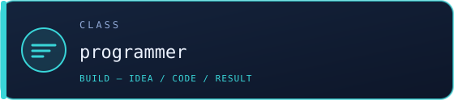
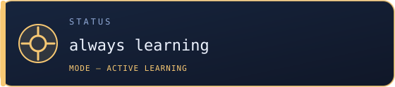
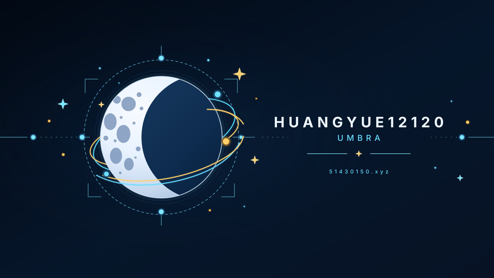

**English** · [简体中文](./README_zh.md)

<pre style="font-family:'Courier New',Courier,monospace;font-size:12px;line-height:1.17;white-space:pre;background-color:#000;color:#fff;padding:8px;margin:0;">█  █ █  █ ▄▀▀▄ █  █ ▄▀▀▀ █  █ █  █ ▄▀▀█ ▄█ █▀▀█ ▄█ █▀▀█ ▄▀▀▄
▓▄▄▓ ▓  ▓ ▓▄▄▓ ▓▄ ▓ ▓ ▀▓ ▀▄▄▓ ▓  ▓ ▓▄▄   ▓    ▓  ▓    ▓ ▓▄ ▓
▒  ▒ ▒  ▒ ▒  ▒ ▒ ▀▒ ▒  ▒    ▒ ▒  ▒ ▒     ▒ ▒▀▀▀  ▒ ▒▀▀▀ ▒ ▀▒
░  ░ ░  ░ ░  ░ ░  ░ ░  ░ ▄  ░ ░  ░ ░  ▄  ░ ░  ░  ░ ░  ░ ░  ░
▀  ▀  ▀▀  ▀  ▀ ▀  ▀  ▀▀▀  ▀▀   ▀▀   ▀▀▀  ▀ ▀▀▀▀  ▀ ▀▀▀▀  ▀▀ </pre>

### _Half-baked programmer_

<table width="100%">
  <tr>
    <td width="33%" valign="top"></td>
    <td width="33%" valign="top"></td>
    <td width="33%" valign="top"></td>
  </tr>
  <tr>
    <td width="33%" valign="top"></td>
    <td width="33%" valign="top"></td>
    <td width="33%" valign="top"></td>
  </tr>

</table>

## CURRENT QUEST

- [ ] Just lay flat like a dried fish  
- [ ] Strive to improve myself  
- [ ] Enough money to vibe coding

---

## SIGNAL CARDS

<table width="100%">
  <tr>
    <!-- WEEKLY_SIGNAL_START -->
    <td width="50%" valign="top">
      <pre style="font-family:monospace;white-space:pre;overflow-x:auto;">+- WEEKLY SIGNAL · W39 --------------------+
|2026-09-21 -&gt; 2026-09-27 · UTC+8          |
+---------------+--------------------------+
|      /\_/\    |01 dms-trellis-… #####  26|
|     ( o.o )   |02 Learning-Atl… ##...   9|
|      &gt; ^ &lt;    |                          |
|     /| # |\   |                          |
|    (_|___|_)  |                          |
|      uid=0    |total commits 35          |
|  $ whoami     |active days 6 / 7         |
|  root         |repos touched 2           |
|   [ROOT CAT]  |busiest 09-25 · 13        |
+---------------+--------------------------+
|average: 5.8 commits / active day         |
|top share: 74% · dms-trellis-card-plugin  |
+------------------------------------------+</pre>
    </td>
    <!-- WEEKLY_SIGNAL_END -->
    <!-- YEARLY_SIGNAL_START -->
    <td width="50%" valign="top">
      <pre style="font-family:monospace;white-space:pre;overflow-x:auto;">+- YEARLY ORBIT · 2026 --------------------+
|2026-01-01 -&gt; 2026-10-01 · UTC+8          |
+------------------------------------------+
|profile commits                        127|
|active repositories                      5|
|profile active days                     46|
|longest streak                     12 days|
|top repository         Learning-Atlas · 62|
|language-tagged repos                    5|
|language 01  Python        60% · 3        |
|language 02  C#            20% · 1        |
|language 03  JavaScript    20% · 1        |
+------------------------------------------+
|source: GitHub contribution graph         |
|through: 2026-10-01 · UTC+8               |
+------------------------------------------+</pre>
    </td>
    <!-- YEARLY_SIGNAL_END -->
</table>

---

## TOOLBOX

<!-- TOOLBOX_START -->
Public repository languages:   

Profile automation:   

Profile format:  
<!-- TOOLBOX_END -->

## LINKS

| destination | link |
| --- | --- |
| GitHub profile | [huangyue12120](https://github.com/huangyue12120) |
| Public repositories | [Browse repositories](https://github.com/huangyue12120?tab=repositories) |

