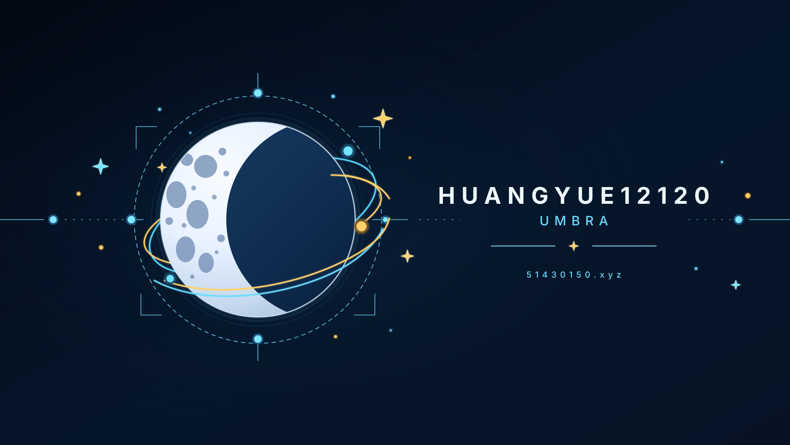

[English](./README.md) · **简体中文**

<pre style="font-family:'Courier New',Courier,monospace;font-size:12px;line-height:1.17;white-space:pre;background-color:#000;color:#fff;padding:8px;margin:0;">█  █ █  █ ▄▀▀▄ █  █ ▄▀▀▀ █  █ █  █ ▄▀▀█ ▄█ █▀▀█ ▄█ █▀▀█ ▄▀▀▄
▓▄▄▓ ▓  ▓ ▓▄▄▓ ▓▄ ▓ ▓ ▀▓ ▀▄▄▓ ▓  ▓ ▓▄▄   ▓    ▓  ▓    ▓ ▓▄ ▓
▒  ▒ ▒  ▒ ▒  ▒ ▒ ▀▒ ▒  ▒    ▒ ▒  ▒ ▒     ▒ ▒▀▀▀  ▒ ▒▀▀▀ ▒ ▀▒
░  ░ ░  ░ ░  ░ ░  ░ ░  ░ ▄  ░ ░  ░ ░  ▄  ░ ░  ░  ░ ░  ░ ░  ░
▀  ▀  ▀▀  ▀  ▀ ▀  ▀  ▀▀▀  ▀▀   ▀▀   ▀▀▀  ▀ ▀▀▀▀  ▀ ▀▀▀▀  ▀▀ </pre>

### _半吊子程序员_

<table width="100%">
  <tr>
    <td width="33%" valign="top"></td>
    <td width="33%" valign="top"></td>
    <td width="33%" valign="top"></td>
  </tr>
  <tr>
    <td width="33%" valign="top"></td>
    <td width="33%" valign="top"></td>
    <td width="33%" valign="top"></td>
  </tr>

</table>

## 当前任务

- [ ] 当条咸鱼躺平
- [ ] 努力提升自己
- [ ] 有钱vibe coding

---

## 信号卡

<table width="100%">
  <tr>
    <!-- WEEKLY_SIGNAL_START -->
    <td width="50%" valign="top">
      <pre>╭─ 每周信号 · W37 ─────────────────────────╮
│2026-09-02 -&gt; 2026-09-08 · UTC+8          │
├───────────────┬──────────────────────────┤
│     /\_/\     │01 huangyue12120 █████   1│
│    ( o.o )    │                          │
│     &gt; ^ &lt;     │                          │
│    /|   |\    │                          │
│   / |___| \   │                          │
│ /___书本___\  │总提交 1                  │
│ |  01  10  |  │活跃日 1 / 7              │
│ `----------'  │涉及仓库 1                │
│   [读书猫]    │峰值 09-03 · 1            │
├───────────────┴──────────────────────────┤
│活跃日均：1.0 次提交                      │
│首位占比：100% · huangyue12120            │
╰──────────────────────────────────────────╯</pre>
    </td>
    <!-- WEEKLY_SIGNAL_END -->
    <!-- YEARLY_SIGNAL_START -->
    <td width="50%" valign="top">
      <pre>╭─ 年度轨道 · 2026 ────────────────────────╮
│2026-01-01 -&gt; 2026-09-08 · UTC+8          │
├──────────────────────────────────────────┤
│贡献图提交                              19│
│活跃仓库                                 2│
│贡献活跃日                              17│
│最长连续                              5 天│
│首位仓库               Deadcells-STS2 · 18│
│标注语言仓库                             3│
│语言 01  Python        33% · 1            │
│语言 02  C#            33% · 1            │
│语言 03  JavaScript    33% · 1            │
├──────────────────────────────────────────┤
│来源：GitHub 贡献图                       │
│截至：2026-09-08 · UTC+8                  │
╰──────────────────────────────────────────╯</pre>
    </td>
    <!-- YEARLY_SIGNAL_END -->
</table>

---

## 工具箱

<!-- TOOLBOX_START -->
公开仓库语言：  

本页自动化：    

页面格式：  
<!-- TOOLBOX_END -->

## 链接

| 去哪 | 链接 |
| --- | --- |
| GitHub 主页 | [huangyue12120](https://github.com/huangyue12120) |
| 公开仓库 | [浏览公开仓库](https://github.com/huangyue12120?tab=repositories) |

