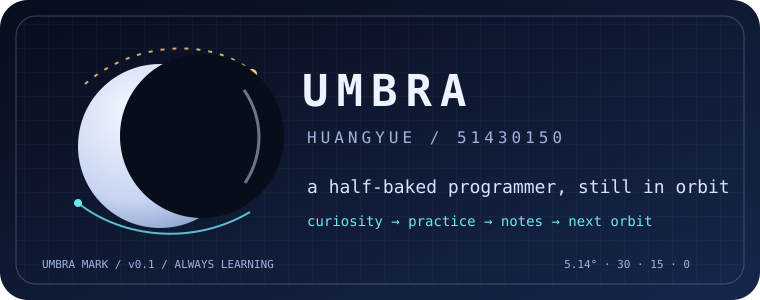

<pre style="font-family:'Courier New',Courier,monospace;font-size:12px;line-height:1.17;white-space:pre;background-color:#000;color:#fff;padding:8px;margin:0;">█  █ █  █ ▄▀▀▄ █  █ ▄▀▀▀ █  █ █  █ ▄▀▀█ ▄█ █▀▀█ ▄█ █▀▀█ ▄▀▀▄
▓▄▄▓ ▓  ▓ ▓▄▄▓ ▓▄ ▓ ▓ ▀▓ ▀▄▄▓ ▓  ▓ ▓▄▄   ▓    ▓  ▓    ▓ ▓▄ ▓
▒  ▒ ▒  ▒ ▒  ▒ ▒ ▀▒ ▒  ▒    ▒ ▒  ▒ ▒     ▒ ▒▀▀▀  ▒ ▒▀▀▀ ▒ ▀▒
░  ░ ░  ░ ░  ░ ░  ░ ░  ░ ▄  ░ ░  ░ ░  ▄  ░ ░  ░  ░ ░  ░ ░  ░
▀  ▀  ▀▀  ▀  ▀ ▀  ▀  ▀▀▀  ▀▀   ▀▀   ▀▀▀  ▀ ▀▀▀▀  ▀ ▀▀▀▀  ▀▀ </pre>

### _Half-baked programmer_ · _半吊子程序员_

<table width="100%">
  <tr>
    <td width="33%" valign="top"></td>
    <td width="33%" valign="top"></td>
    <td width="33%" valign="top"></td>
  </tr>
  <tr>
    <td width="33%" valign="top"></td>
    <td width="33%" valign="top"></td>
    <td width="33%" valign="top"></td>
  </tr>

</table>

## CURRENT QUEST

- [ ] 把一个模糊想法做成可以运行的小东西
- [ ] 把刚学会的内容讲到别人也能看懂
- [ ] 少一点“以后再整理”，多一点真正收尾

---

## SIGNAL CARDS

<!--
Workflow contract (future implementation):
1. weekly-card: run every Monday and replace the five repo slots plus the summary.
2. yearly-card: run daily and replace the language/season rows.
3. Keep the same visual frame so the profile stays stable while the data changes.
The placeholders below are just placeholders — swap in real numbers once the automation exists.
-->

<table width="100%">
  <tr>
    <!-- WEEKLY_SIGNAL_START -->
    <td width="50%" valign="top">
      <pre>
╭─ WEEKLY SIGNAL ─────────╮
│            __           │
│    (___()'`;            │
│     /,    /`            │
│     \\"--\\             │
├─────────────────────────┤
│ 01  repo-name   ░░░ --  │
│ 02  repo-name   ░░░ --  │
│ 03  repo-name   ░░░ --  │
│ 04  repo-name   ░░░ --  │
│ 05  repo-name   ░░░ --  │
├─────────────────────────┤
│ summary: still moving   │
╰─────────────────────────╯
      </pre>
    </td>
    <!-- WEEKLY_SIGNAL_END -->
    <!-- YEARLY_SIGNAL_START -->
    <td width="50%" valign="top">
      <pre>
╭─ YEARLY ORBIT ────────────╮
│    2026 / learning log    │
├───────────────────────────┤
│ build      ████░░░░░░     │
│ read       ██████░░░░     │
│ write      ██░░░░░░░░     │
│ finish     ███░░░░░░░     │
├───────────────────────────┤
│ season: under construction│
│ next: another small quest │
╰───────────────────────────╯
      </pre>
    </td>
    <!-- YEARLY_SIGNAL_END -->
</table>

---

## TOOLBOX

这里放真实使用中的语言、工具和工作方式。先不把“看过教程”写成“熟练掌握”。

`learning` · `building` · `debugging` · `writing things down`

<!-- Add actual technologies here once you decide which ones deserve a permanent place. -->

## LINKS / CONTACT

| kind | entry |
| --- | --- |
| GitHub | [huangyue12120](https://github.com/huangyue12120) |
| repositories | [browse repositories](https://github.com/huangyue12120?tab=repositories) |
| personal coordinate | `umbra51430150` |
| website / email / papers | add when ready |

## UMBRA MARK

`UMBRA` is the shadow; `51430150` is the coordinate; `HUANGYUE` is the person still in orbit.

## UMBRA CYCLE

`30 → 15 → 0 → 15 → 30` 只是坐标数字变成的一段小循环，看个意思就好。

